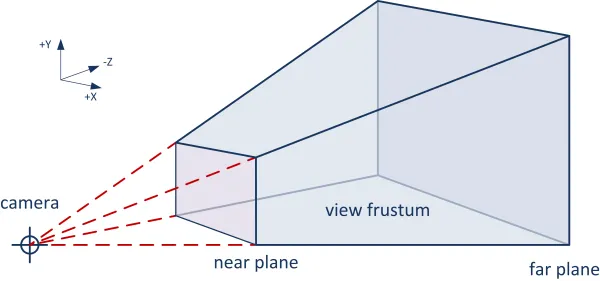

В [[connecting-the-library-to-the-page|предыдущей главе]], мы подключили библиотеку к странице, а это значит, что теперь мы можем применить её по назначению.

Прежде чем отрисовать какой-либо трёхмерный объект с `Three.js`, нам нужно познакомиться с тремя фундаментальными понятиями, тремя объектами библиотеки без которых не может существовать ни одно 3D приложение.

Итак, это `Renderer`, `Scene` и `Camera`.

# Renderer

Или, если быть более точным - `WebGLRenderer`.

Это самый основной объект библиотеки. В его ответственность входит отображение созданных нами 3D моделей при помощи лежащей в основе технологии [WebGL](https://developer.mozilla.org/en-US/docs/Glossary/WebGL)^[Web Graphics Library] [JS API](https://developer.mozilla.org/en-US/docs/Web/API/WebGL_API).

Первым делом нам необходимо создать экземпляр этого объекта.

```javascript
const renderer = new THREE.WebGLRenderer();
```

У конструктора много аргументов, и к счастью они все опциональны, поэтому пока не будем забивать ими себе голову, и вернёмся к ним по мере погружения в предмет.

Экземпляр `WebGLRenderer` объекта, содержит несколько базовых свойств и методов, которые сразу требуют нашего внимания. Ссылку на элемент холста `domElement`^[По умолчанию это поле размером 300x150 пикселей], на котором будет происходить рендер. Метод `setSize`^[`setSize(width: number, height: number, updateStyle?: boolean): void`], при помощи которого можно изменить размеры элемента холста и связанную с контекстом область просмотра или `viewport`^[по умолчанию обновляются и размеры заданные в CSS]. И метод `render`^[`render(scene: Object3D, camera: Camera): void`], который и будет визуализировать наш 3D мир.

Ему необходимо передать два других важных "персонажа",
Сцену и Камеру.

> В качестве параметров, конструктор `WebGLRenderer` может принимать элемент холста на котором будет производиться отрисовка, в этом случае подразумевается что мы уже создали `canvas` элемент и добавили его в `DOM`. С большей гибкостью приходит и большая ответственность, и нам важно повысить вес селектора (например добавить к элементу CSS класс), так как различные браузерные расширения могут добавлять в разметку свои элементы, а нам важно получить именно наш холст. Конечно существует вероятность совпадения, CSS модули вам в помощь.
> Остальные параметры отвечают за передачу или настройку контекста рендеринга. Тема контекста рендеринга, что это такое, и как с ним работать мы рассмотрим [[webgl-renderer-context|в продвинутой части учебника]], посвящённой WebGL JS API.

# Scene

Сцена, это и есть наш `3D` мир, который и будет визуализировать `Renderer`.

Подобно тому как `html` документ описывает `web` страницу, сцена описывает `3D` мир.

Это абстракция, которая содержит в себе все наши трёхмерные объекты с их расположением и иерархической зависимостью составных частей.

Абстракция, которая содержит источники света и дополнительные объективы камер.

Подобие театральной сцены с декорациями, располагая которые, мы создаём необходимую атмосферу нашего мира.

Всё что должно быть отображено на экране, должно быть на сцене.

Технически, сцена - это иерархический объект (реализация паттерна компоновщик) расширяющий тип `Object3D`, который может содержать в себе другие рекурсивно вложенные объекты такого же типа.

Создадим его при помощи конструктора `Scene`.

```javascript
const scene = new THREE.Scene();
```

# Camera

Камера, это специальный объект, так же расширяющий тип `Object3D`, который проецирует сцену на экран пользователю.

Любая камера наследуется от абстрактного класса `Camera`.

С точки зрения проекции нам доступны две её разновидности:

- Ортогональная камера (`OrthographicCamera`) - режим при котором удалённость части объекта от камеры не влияет на его размер, выражаясь математически, зависимость между расстоянием до камеры и отображаемым размером - постоянная (константная);
- Перспективная камера (`PerspectiveCamera`) - режим при котором зависимость между удалённостью части объекта и его размером линейная, этот режим спроектирован чтобы имитировать человеческий глаз и является наиболее распространённым режимом для рендеринга 3D сцен.

Помимо этих двух, существуют производные от перспективной камеры:

- `ArrayCamera` - представляет собой набор `PerspectiveCamera`;
- `CubeCamera` - комбинация из шести `PerspectiveCamera`;
- `StereoCamera` - комбинация из двух `PerspectiveCamera`;

Но, это уже совсем другая история, которая будет детально разобрана [[camera-types|в соответствующих частях учебника]].

Воспользуемся базовым, наиболее распространённым типом, и создадим экземпляр камеры.

Конструктор `PerspectiveCamera` принимает 4 параметра

- `fov` - **field of view**, измеряется в градусах, описывает вертикальный угол обзора (по умолчанию 50 градусов)
- `aspect` - отношение ширины к высоте, представляет простое число (по умолчанию 1)
- `near` и `far` - описывают пространство, которое будет отображаться со всем содержимым сцены попавшем в него (по умолчанию 0.1 и 2000 соответственно)^[ Значения `near` и `far` влияют на точность буфера глубины (z-buffer). Слишком маленькое значение `near` (например 0.0001) или слишком большое `far` (например 1000000) приводят к артефакту **z-fighting** - мерцанию поверхностей расположенных близко друг к другу. Для оптимальной точности, устанавливайте `near` как можно больше, а `far` как можно меньше, при этом сохраняя видимость всех необходимых объектов сцены.]

Этими параметрами задаётся трёхмерная фигура, усечённая пирамида (**frustum**)



Всё, что находится на сцене и попадает внутрь этой фигуры, будет отображено на экране пользователя.

Сделаем большой угол зрения чтобы охватить нашу будущую вселенную целиком, увеличим его вдвое.
Соотношение сторон установим равным 2. Так как мы не создавали свой собственный холст, конструктор `WebGLRenderer` создал его за нас, его размеры по умолчанию составляют 300x150, отсюда получаем отношение сторон равным 2 (300 / 150)
Остальные параметры оставим без изменений

```javascript
const camera = new THREE.PerspectiveCamera(100, 2);
```

# Собираем всё вместе

Отлично, теперь мы можем отрисовать при помощи рендерера нашу сцену через нашу камеру.

```javascript
renderer.render(scene, camera);
```

Но на данном этапе никаких изменений на странице мы с вами не обнаружим.

Как мы подмечали выше, всё дело в том, что при создании рендерера, был создан элемент `canvas` и контекст рендеринга на нём. Но сам элемент не был добавлен на страницу.

Чтобы исправить это, вызовем метод `append` элемента `body` в который и передадим созданный конструктором элемент `canvas`.

```javascript
document.body.append(renderer.domElement);
```

И вот мы с вами смотрим вглубь вселенной, до большого взрыва.

Мы видим чёрный экран.

<iframe src="https://tutorial-sandbox-git-lesson-02-step-01-three-js-diving.vercel.app/"></iframe>

Настало время привнести что-то в наш дивный новый мир.

# Опишем простейшую сцену

Как мы уже узнали, сцена - это иерархический объект, который организует все объекты нашего 3D мира.

Для простоты, сейчас не будем создавать сложные структуры, а просто добавим простейшую трёхмерную фигуру - шар.

Шар, как и любая другая модель в 3D представляет собой сетку полигонов, сетка на языке оригинала означает **mesh**.

Каждый полигон состоит из вершин (**vertex**), рёбер - линий соединяющих две вершины, и грани - плоскости, образуемой между рёбрами.

> Для большей детализации используется большее количество полигонов. Тут имеем компромисс, чем больше полигонов на объекте, тем сложнее видеокарте его визуализировать, что сказывается на конечной производительности.

`Mesh` - объект в `Three.js` так же как `Scene` и `Camera` расширяющий тип `Object3D` - это цифровая модель трёхмерного объекта.

Для того чтобы описать модель, нам нужно описать его геометрию, и характеристики его материала.

Геометрия может быть сколь угодно сложной, и зачастую создаётся в специализированных редакторах, таких как **Blender**. Тем не менее `Three.js` предоставляет ряд примитивов, геометрий базовых трёхмерных фигур.
Для нашей цели нам подойдёт `SphereGeometry`.

```javascript
const geometry = new THREE.SphereGeometry(10);
```

Конструктор геометрии сферы, может принимать множество аргументов, мы их разберём в отдельной главе, посвящённой примитивным фигурам. Сейчас, для простоты используем короткую форму, в этом случае, конструктор принимает радиус создаваемой сферы.

Теперь опишем материал, используя конструктор базового материала сетки `MeshBasicMaterial`.
Конструктор принимает объект параметров, для наших целей достаточно задать цвет.

```javascript
const material = new THREE.MeshBasicMaterial({ color: 0xfbec5d });
```

Создадим один такой объект при помощи конструктора `Mesh`.

```javascript
const particle = new THREE.Mesh(geometry, material);
```

И добавим на сцену при помощи метода `add` унаследованного от `Object3D`. Этот метод в качестве параметра принимает другой объект такого же типа.

```javascript
const geometry = new THREE.SphereGeometry(10);
const material = new THREE.MeshBasicMaterial({ color: 0xfbec5d });
const particle = new THREE.Mesh(geometry, material);

scene.add(particle);
```

Отлично, но мы по-прежнему видим чёрный квадрат.

Давайте разбираться.

Дело в том, что по умолчанию элементы добавляются в нулевую точку сцены.
Поэтому и наши шары, и наша камера в текущий момент находятся в одной точке, и получается что камера находится внутри шара.

Настройки рендера по умолчанию отключают визуализацию обратных граней фигур, это можно настраивать, но это не то что нам в действительности нужно.

Нам нужно разместить нашу камеру так, чтобы в проецируемую ею усечённую пирамиду, попали наши шары.
Для этого просто сдвинем её.

```javascript
camera.position.z = 30;
```

Отлично!

Теперь обогатим нашу сцену и создадим побольше подобных шарообразных частиц.

Для удобства создания большого количества объектов, напишем фабричную функцию. Она будет генерировать большое количество шаров и возвращать их в виде массива. Для разнообразия создадим шары разного диаметра. Для этого создадим вспомогательную функцию по генерации случайного числа из диапазона.

> Для решения задачи, можно поддаться искушению создавать сферические геометрии разного диаметра прямо в цикле. Такой практики лучше избегать.
> В этом случае, на каждой итерации цикла будет создаваться экземпляр геометрии и ссылка на этот объект будет сохраняться в экземпляре **mesh** объекта, сохраняя объект геометрии в памяти. Отсюда увеличивается количество используемой памяти. Вместо указания на один общий объект геометрии, каждый меш, содержит свой собственный.
> Лучшим решением будет создать один объект геометрии, и при создании **mesh** объекта, задавать индивидуальные характеристики. Для изменения масштаба, в экземпляре объекта `Mesh` существует объект свойство `scale` типа `Vector3`. Метод `setScalar` позволяет задать коэффициент масштабирования своим единственным аргументом. Его и используем для решения нашей задачи.

```javascript
function particlesFactory() {
  const particles = [];
  const geometry = new THREE.SphereGeometry(20);
  const material = new THREE.MeshBasicMaterial({ color: 0xfbec5d });

  for (let i = 0; i < 10000; i++) {
    const particle = new THREE.Mesh(geometry, material);
    const scale = getRandomNumber(0.1, 1);

    particle.scale.setScalar(scale);

    particles.push(particle);
  }

  return particles;
}

function getRandomNumber(min, max) {
  return min + Math.random() * (max - min);
}
```

Создадим наши частицы и добавим в нашу сцену

> Как мы обсудили, объект сцены реализует интерфейс `Object3D`. Метод `add` такого объекта, может получать множество аргументов, поочерёдно добавляя их на сцену.

```javascript
const particles = particlesFactory();

scene.add(...particles);
```

<iframe src="https://tutorial-sandbox-git-lesson-02-step-02-three-js-diving.vercel.app/"></iframe>

Отлично, в нашей вселенной появились первые частицы, но течение времени ещё не началось. Мы смотрим на сцену, как на фотографию, на статическую картинку, давайте добавим в наш мир и время.

# Опишем цикл рендеринга

Работа рендерера похожа на работу проигрывателя киноплёнки.

Кадры сменяют друг друга, и из-за высокой частоты смены кадра, статические картинки оживают.

Для этого нам нужно, вносить изменения в нашу сцену, визуализировать их, вновь вносить изменения, и вновь визуализировать их, и так за кадром кадр.

Для того чтобы это реализовать, напишем рекурсивную функцию, которая будет вызывать метод `render` и передавать внутрь нашу сцену.

```javascript
function render(time) {
  // Change scene
  renderer.render(scene, camera);
  requestAnimationFrame(render);
}
```

И запустим его

```javascript
render(0);
```

Отлично, теперь в нашем мире затикали часы.

<iframe src="https://tutorial-sandbox-git-lesson-02-step-03-three-js-diving.vercel.app/"></iframe>

Ничего не поменялось. И это понятно. Жизнь - в движении.

Осталось добавить движения нашим частицам.

# Изменения в сцене

В цикл рендеринга, нам нужно добавить логику по изменению положения добавленных нами на сцену частиц.

Ссылки на эти частицы хранятся в массиве `particles`.

Мы можем проходя по циклу частиц, для каждой изменять её координаты по некоторому принципу.

Для простоты, с каждой частицей, в момент создания, свяжем информацию о её движении, а именно дельту по каждой из осей за единицу времени, и будем использовать эту информацию для расчёта нового положения частицы в пространстве.

В нашей фабрике, помимо установки масштаба, определим для частицы её скорость и рассчитаем дельту, сохранив в собственном поле.

```javascript
// ...
const speed = getRandomNumber(0.1, 10);
particle.deltaX = speed * getRandomNumber(-2, 2);
particle.deltaY = speed * getRandomNumber(-2, 2);
particle.deltaZ = speed * getRandomNumber(-2, 2);
// ...
```

В новой функции `move` проитерируемся по всем частицам и к текущему положению прибавим приращение с учётом скорости частицы.

```js
function move() {
  particles.forEach((particle) => {
    particle.position.x += particle.deltaX;
    particle.position.y += particle.deltaY;
    particle.position.z += particle.deltaZ;
  });
}
```

> Каждая частица - это экземпляр объекта `Mesh`, и хотя у нас есть техническая возможность сохранять свои свойства в экземпляр, этого лучше избегать, свойство добавленное таким образом будет видно коду библиотеки, что со временем может привести к конфликтам, например при добавлении подобных полей в будущих версиях библиотеки, или к нежелательному попаданию наших свойств в рамках возможного перебора при помощи цикла `for..in`.
> Чтобы это исправить, мы можем хранить эти данные отдельно, либо скрыть наши данные при помощи символьных ключей для наших полей.
> Важно, для этой задачи избегать искушения использовать глобальные символы, так как они покрывают описанную нами проблему только на половину. Такой подход предоставляет компромисс между удобством (нет необходимости думать о том где должен находиться символ и как им поделиться) и приватностью обеспечивающую гарантию конфиденциальности.

Для этого, в рамках нашего простого примера, создадим символьные ключи в контексте модуля (до вызова использующих функций `particlesFactory` и `move`).

```js
// ...
const deltaX = Symbol("deltaX");
const deltaY = Symbol("deltaY");
const deltaZ = Symbol("deltaZ");
// ...
```

Теперь заменим в фабричной функции строковые ключи на символьные, ссылаясь на них в замыкании.

```javascript
// ...
particle[deltaX] = speed * getRandomNumber(-2, 2);
particle[deltaY] = speed * getRandomNumber(-2, 2);
particle[deltaZ] = speed * getRandomNumber(-2, 2);
// ...
```

А в функции `move` изменим обращение к этим полям

```javascript
// ...
particle.position.x += particle[deltaX];
particle.position.y += particle[deltaY];
particle.position.z += particle[deltaZ];
// ...
```

Отлично. Теперь, обновив страничку мы увидим "нашу" вселенную после большого взрыва!

<iframe src="https://tutorial-sandbox-git-lesson-02-step-final-three-js-diving.vercel.app/"></iframe>

# Итого

В рамках главы мы создали рендерер, сцену и камеру.
Чтобы визуально убедиться что мы всё сделали верно, мы создали 3D объекты и добавили их на сцену, а так же определили логику движения для каждого из них. Написали цикл рендеринга, в котором объединили вместе рендерер, сцену и камеру.
В результате мы имеем анимированную сцену, правда очень маленьких размеров. Быстрая попытка сделать приложение полноэкранным, приводит к нежелательным результатам, а именно, потере качества картинки. В [[Создаём холст чувствительный к размерам экрана|следующей главе]], разберёмся как это исправить и что необходимо, для того чтобы сделать 3D приложение адаптивным.
